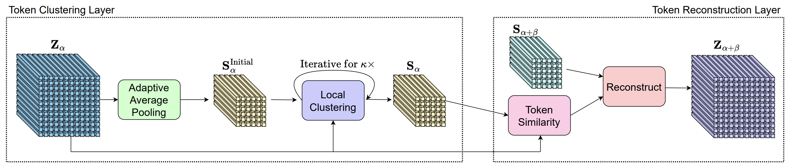

# Expediting Large-Scale Vision Transformer for Dense Prediction without Fine-tuning

## Introduction

This is the official implementation of the paper "[Expediting Large-Scale Vision Transformer for Dense Prediction without Fine-tuning](https://arxiv.org/abs/2210.01035)" on [Mask2Former](https://arxiv.org/abs/2112.01527). 




## Results 

Here we implement our method on Swin backbone. Thus we report the GFLOPs and FPS of backbone. 

### COCO

#### Panoptic Segmentation

| Method             | Backbone | $\alpha$ | h $\times$ w   | GFLOPs | FPS  | PQ   | config |
| ------------------ | -------- | -------- | -------------- | ------ | ---- | ---- | ------ |
| Mask2Former        | Swin-L   | -        | 12 $\times$ 12 | 937    | 4.3  | 57.8 | [config](https://github.com/Expedit-LargeScale-Vision-Transformer/Expedit-Mask2Former/blob/master/configs/coco/panoptic-segmentation/swin/maskformer2_swin_large_IN21k_384_bs16_100ep.yaml)       |
| Mask2Former + Ours | Swin-L   | 10       | 8 $\times$ 8   | 663    | 5.9  | 56.8 | [config](https://github.com/Expedit-LargeScale-Vision-Transformer/Expedit-Mask2Former/blob/master/configs/coco/panoptic-segmentation/swin/maskformer2_hourglass_swin_large_IN21k_384_bs16_100ep.yaml)       |

#### Instance Segmentation

| Method             | Backbone | $\alpha$ | h $\times$ w   | GFLOPs | FPS  | mask AP | config |
| ------------------ | -------- | -------- | -------------- | ------ | ---- | ------- | ------ |
| Mask2Former        | Swin-L   | -        | 12 $\times$ 12 | 937    | 4.3  | 50.1    | [config](https://github.com/Expedit-LargeScale-Vision-Transformer/Expedit-Mask2Former/blob/master/configs/coco/instance-segmentation/swin/maskformer2_swin_large_IN21k_384_bs16_100ep.yaml)       |
| Mask2Former + Ours | Swin-L   | 12       | 8 $\times$ 8   | 705    | 5.4  | 49.1    | [config](https://github.com/Expedit-LargeScale-Vision-Transformer/Expedit-Mask2Former/blob/master/configs/coco/instance-segmentation/swin/maskformer2_hourglass_swin_large_IN21k_384_bs16_100ep.yaml)       |

### ADE20K

#### Panoptic Segmentation

| Method             | Backbone | $\alpha$ | h $\times$ w   | GFLOPs | FPS  | PQ   | config |
| ------------------ | -------- | -------- | -------------- | ------ | ---- | ---- | ------ |
| Mask2Former        | Swin-L   | -        | 12 $\times$ 12 | 937    | 4.4  | 48.0 | [config](https://github.com/Expedit-LargeScale-Vision-Transformer/Expedit-Mask2Former/blob/master/configs/ade20k/panoptic-segmentation/swin/maskformer2_swin_large_IN21k_384_bs16_160k.yaml)       |
| Mask2Former + Ours | Swin-L   | 14       | 8 $\times$ 8   | 769    | 5.3  | 47.6 | [config](https://github.com/Expedit-LargeScale-Vision-Transformer/Expedit-Mask2Former/blob/master/configs/ade20k/panoptic-segmentation/swin/maskformer2_hourglass_swin_large_IN21k_384_bs16_160k.yaml)       |

#### Semantic Segmentation

| Method             | Backbone | $\alpha$ | h $\times$ w   | GFLOPs | FPS  | mIoU | config |
| ------------------ | -------- | -------- | -------------- | ------ | ---- | ---- | ------ |
| Mask2Former        | Swin-L   | -        | 12 $\times$ 12 | 937    | 4.3  | 55.8 | [config](https://github.com/Expedit-LargeScale-Vision-Transformer/Expedit-Mask2Former/blob/master/configs/ade20k/semantic-segmentation/swin/maskformer2_swin_large_IN21k_384_bs16_160k_res640.yaml)       |
| Mask2Former + Ours | Swin-L   | 8        | 8 $\times$ 8   | 620    | 6.2  | 55.5 | [config](https://github.com/Expedit-LargeScale-Vision-Transformer/Expedit-Mask2Former/blob/master/configs/ade20k/semantic-segmentation/swin/maskformer2_hourglass_swin_large_IN21k_384_bs16_160k_res640.yaml)       |

### Video Instance Segmentation

#### YouTubeVIS 2019

| Method             | Backbone | $\alpha$ | h $\times$ w   | GFLOPs | FPS  |  AP  | config |
| ------------------ | -------- | -------- | -------------- | ------ | ---- | ---- | ------ |
| Mask2Former        | Swin-L   | -        | 12 $\times$ 12 | 8957   | 0.51 | 60.4 | [config](https://github.com/Expedit-LargeScale-Vision-Transformer/Expedit-Mask2Former/blob/master/configs/youtubevis_2019/swin/video_maskformer2_swin_large_IN21k_384_bs16_8ep.yaml)       |
| Mask2Former + Ours | Swin-L   | 14       | 8 $\times$ 8   | 7631   | 0.60 | 60.2 | [config](https://github.com/Expedit-LargeScale-Vision-Transformer/Expedit-Mask2Former/blob/master/configs/youtubevis_2019/swin/video_maskformer2_hourglass_swin_large_IN21k_384_bs16_8ep.yaml)       |

#### YouTubeVIS 2021

| Method             | Backbone | $\alpha$ | h $\times$ w   | GFLOPs | FPS  |  AP  | config |
| ------------------ | -------- | -------- | -------------- | ------ | ---- | ---- | ------ |
| Mask2Former        | Swin-L   | -        | 12 $\times$ 12 | 7159   | 0.63 | 52.6 | [config](https://github.com/Expedit-LargeScale-Vision-Transformer/Expedit-Mask2Former/blob/master/configs/youtubevis_2021/swin/video_maskformer2_swin_large_IN21k_384_bs16_8ep.yaml)       |
| Mask2Former + Ours | Swin-L   | 14       | 8 $\times$ 8   | 6253   | 0.72 | 51.8 | [config](https://github.com/Expedit-LargeScale-Vision-Transformer/Expedit-Mask2Former/blob/master/configs/youtubevis_2021/swin/video_maskformer2_hourglass_swin_large_IN21k_384_bs16_8ep.yaml)       |

## Installation

See [installation instructions](INSTALL.md).

## Getting Started

See [Preparing Datasets for Mask2Former](datasets/README.md).

See [Getting Started with Mask2Former](GETTING_STARTED.md).

## Acknowledgement
The repo is built based on [Mask2Former](https://github.com/facebookresearch/Mask2Former). We thank the authors for their great work.

## Citation
If you find this project useful in your research, please consider cite:

```BibTex
@article{liang2022expediting,
	author    = {Liang, Weicong and Yuan, Yuhui and Ding, Henghui and Luo, Xiao and Lin, Weihong and Jia, Ding and Zhang, Zheng and Zhang, Chao and Hu, Han},
	title     = {Expediting large-scale vision transformer for dense prediction without fine-tuning},
	journal   = {arXiv preprint arXiv:2210.01035},
	year      = {2022},
}
```

```BibTeX
@article{cheng2021mask2former,
  title={Masked-attention Mask Transformer for Universal Image Segmentation},
  author={Bowen Cheng and Ishan Misra and Alexander G. Schwing and Alexander Kirillov and Rohit Girdhar},
  journal={arXiv},
  year={2021}
}
```
